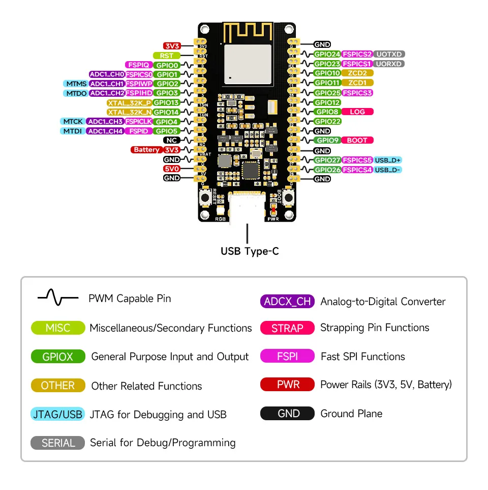
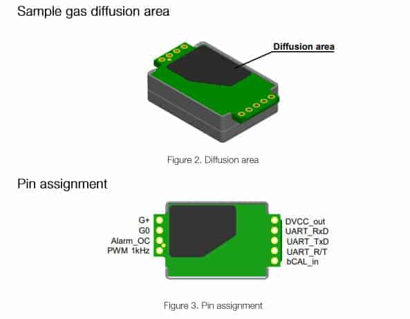

# ESP32-H2 Zigbee CO2 Sensor (Rust)

A battery-free, WiFi-free indoor air-quality sensor: an **ESP32-H2** reads CO2 from a **Senseair S8** and reports it over **Zigbee** into Home Assistant via Zigbee2MQTT. The onboard RGB LED gives an at-a-glance air-quality indication. Firmware is written in **Rust** (std/ESP-IDF with Espressif's Zigbee SDK via FFI).

## Features

- **CO2 measurement** every 10–300 s (interval adjustable live from Home
  Assistant) using the S8's Modbus RTU interface
- **Zigbee End Device** — no WiFi credentials, no MQTT config on the device;
  it joins the Zigbee mesh like any commercial sensor
- **LED air-quality indicator** — brightness adjustable from HA, 0 % = off
- **Settings survive in HA**: report interval and LED brightness are Zigbee
  attributes, exposed as number sliders in Home Assistant

### LED colors

| CO2 | LED |
|---|---|
| ≤ 1000 ppm | green — good |
| 1001–2000 ppm | orange — fair/poor |
| 2001–5000 ppm | red — bad |
| > 5000 ppm | flashing red — dangerous |

## How it works

The device exposes three Zigbee endpoints, decoded by the external converter [`Co2-Sensor.js`](Co2-Sensor.js):

| EP | ZCL Cluster | Purpose |
|---|---|---|
| 1 | Temperature Measurement | **CO2 carrier**: ppm is stored as ppm/100 °C, so the ZCL INT16 `measuredValue` equals ppm directly. (The standard CO2 cluster isn't reportable in the SDK's attribute tables; temperature is.) |
| 2 | Analog Output | Report interval in seconds, read/write |
| 3 | Analog Output | LED brightness 0–100 %, read/write |

CO2 reporting uses ZCL *configured reporting*: on join, the converter's `configure` step binds endpoint 1 to the coordinator and configures reporting; from then on the firmware only updates the attribute value and the stack reports changes automatically.

## Hardware

| Component | Details |
|---|---|
| Microcontroller | ESP32-H2-DevKit-N4 (4 MB flash, USB-C) |
| CO2 sensor | Senseair S8 004-0-0053 (10 000 ppm, Modbus RTU @ 9600 8N1) |
| Zigbee coordinator | Sonoff Zigbee 3.0 USB Dongle Plus |
| Integration | Zigbee2MQTT + Home Assistant |

## Wiring

Only four wires are needed, all on the **left header (J1)** of the DevKit:

| S8 Pin | ESP32-H2 Pin | J1 position | Purpose |
|---|---|---|---|
| G+ | 5V0 | pin 14 | Power (S8 needs 4.5–5.25 V) |
| G0 | GND | pin 13 | Ground |
| UART_TxD | GPIO4 | pin 9 | Sensor → ESP data |
| UART_RxD | GPIO5 | pin 10 | ESP → Sensor data |

> The S8 is powered from 5 V but its UART is 3.3 V logic — it connects to the
> ESP32-H2 directly, **no level shifter needed**.
>
> The RGB status LED is the onboard WS2812 on **GPIO8** (this board uses RGB
> byte order, not the usual GRB) — no wiring required.

### ESP32-H2-DevKit-N4 pinout



### Senseair S8 pinout



The S8 talks Modbus RTU; the firmware polls input register 3 (CO2 ppm) with the request `FE 04 00 03 00 01 D5 C5` and parses the 7-byte response.

## Firmware

The firmware (**v2.0**) lives in [`Rust/`](Rust/) — see [`Rust/README.md`](Rust/README.md) for toolchain setup, build & flash instructions, serial monitoring, and the hard-won ESP32-H2 lessons (esp-idf-hal bugs, linker workarounds, Zigbee stack pitfalls).

| Component | Version |
|---|---|
| Rust | nightly, std on `riscv32imac-esp-espidf` |
| esp-idf-svc | 0.51 |
| ESP-IDF | v5.3.3 |
| esp-zigbee-lib / esp-zboss-lib | 1.6 (ESP-IDF remote components, FFI via bindgen) |
| Zigbee2MQTT | via Home Assistant add-on |

> The original Arduino-based firmware (v1.3) was removed after the Rust port
> was verified end-to-end; it remains available in git history.

## Zigbee2MQTT setup

1. Copy `Co2-Sensor.js` into the Zigbee2MQTT external converters folder
   (`config/zigbee2mqtt/external_converters/` or add via the Z2M frontend
   under Settings → External converters).
2. Enable **Permit join** and power the device. It joins, the interview
   discovers the three endpoints, and the converter exposes:
   `co2` (ppm), `report_interval` (s), `led_brightness` (%),
   `firmware_version`.
3. Optional: give it a friendly name and a custom icon (below).

## Project Files

| File | Description |
|---|---|
| `Rust/` | Rust firmware (current) |
| `Co2-Sensor.js` | Zigbee2MQTT external converter |
| `Specs/` | Pinout diagrams (ESP32-H2 DevKit, Senseair S8) |
| `Logo/` | Device icon for Zigbee2MQTT |
| `CHANGELOG.md` | Version history and key lessons learned |

## Adding a Custom Device Icon in Zigbee2MQTT

To display a custom logo or image for your device in the Zigbee2MQTT frontend:

**1. Prepare the Image Directory**

* Navigate to your Zigbee2MQTT configuration folder (typically `config/zigbee2mqtt/`).
* Create a new folder named `device_icons` (if it does not already exist).
* Place your custom image file (e.g., `co2-sensor.png`) inside this folder. The recommended format is a square PNG.

**2. Update the Configuration**

* Open your `zigbee2mqtt/configuration.yaml` file.
* Locate your device under the `devices:` section using its IEEE address.
* Add the `icon` property. **Important:** The path must explicitly start with `device_icons/` followed by your filename.

**Example `configuration.yaml` entry:**

```yaml
devices:
  '0xYOUR_DEVICE_IEEE_ADDRESS':
    friendly_name: Your_Device_Name
    icon: device_icons/co2-sensor.png
```

**3. Apply Changes**

* Restart the Zigbee2MQTT add-on to apply the configuration. Your custom icon will now appear in the Z2M dashboard.
